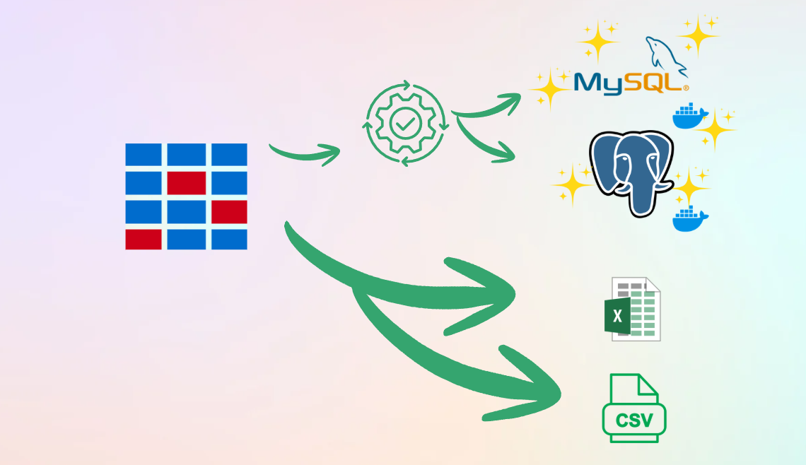
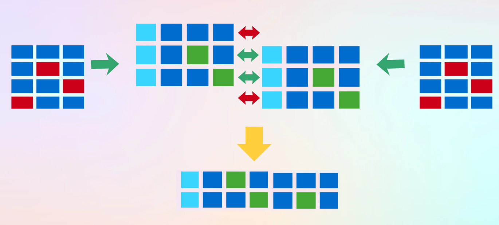
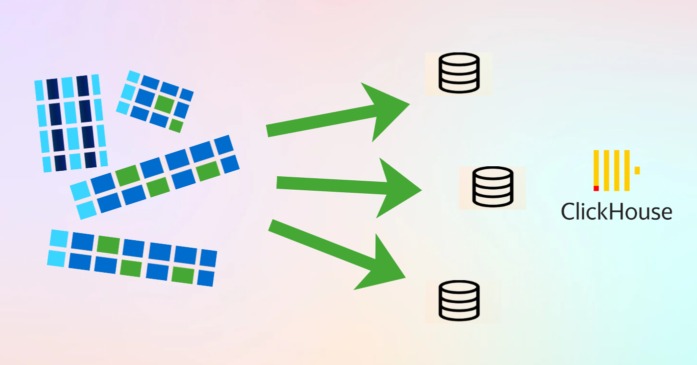
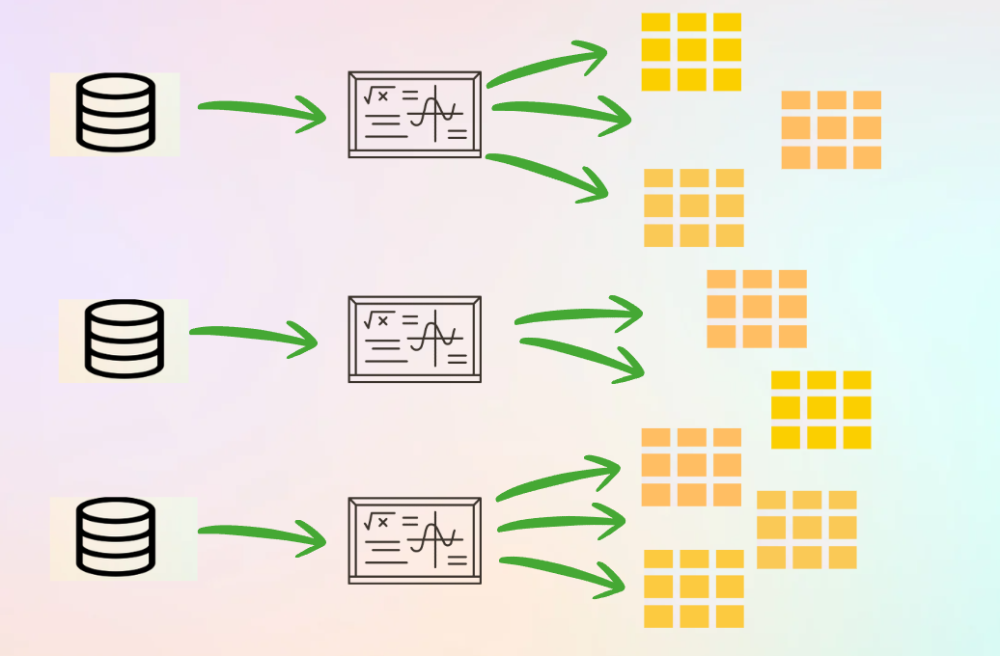
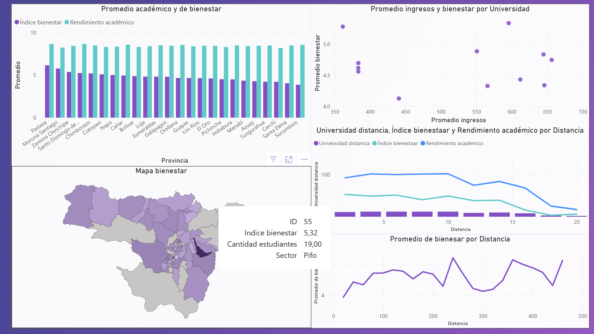
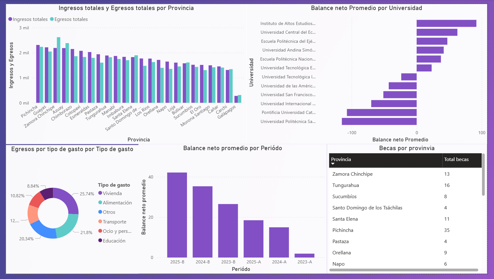

# Análisis de datos de estudiantes foráneos

**Repositorio del proyecto:**  
[Ver el proyecto completo en GitHub](https://github.com/XLex0/AnalisisDatosEstudiantesForaneos-BI)

  
  
  
  
  
  

## Colaboradores

* **Alexander Motoche:** Diseño, desarrollo e implementación de todo el ciclo de vida de Business Intelligence (BI). Responsable absoluto de la arquitectura técnica del proyecto:
    * **Ingeniería de Datos:** Desarrollo de scripts en Python (Jupyter Notebooks) para la generación de datos sintéticos complejos, simulando entornos reales con ruido y problemas de calidad de datos.
    * **Pipeline ETL:** Construcción del proceso completo de extracción, transformación, limpieza y unificación de fuentes heterogéneas (MySQL, PostgreSQL, CSV y Excel) en una tabla maestra unificada.
    * **Modelado e Infraestructura OLAP:** Configuración del entorno en ClickHouse, diseño de la arquitectura bajo un modelo en estrella y segmentación en datamarts especializados (Bienestar, Economía y Gastos).
    * **Optimización de Consultas:** Implementación de vistas agregadas en ClickHouse para automatizar el cálculo de métricas de rendimiento y variables socioeconómicas.
    * **Visualización y Analítica de Negocio:** Diseño técnico y maquetación de los dashboards interactivos en Power BI (Dashboard de Bienestar y Dashboard de Economía) enfocados en el análisis territorial, socioeconómico y académico para la toma de decisiones.

### Objetivo

Optimizar el apoyo académico y financiero para los estudiantes foráneos, proporcionando a los responsables de la toma de decisiones información clave sobre su bienestar y situación económica.

A través de dashboards interactivos, se identifican patrones y relaciones entre factores como rendimiento académico, índice de bienestar y condiciones económicas, permitiendo a la universidad implementar políticas y estrategias que mejoren la calidad de vida y el rendimiento, y optimicen el uso de los recursos disponibles.

### Visión General del Proyecto

El repositorio simula un ciclo completo de Business Intelligence (BI) aplicado a estudiantes foráneos, abarcando desde la creación de datos hasta la elaboración de dashboards interactivos. El flujo se desarrolla en cuatro grandes etapas:

1. Generación de datos sintéticos  
2. ETL e integración de las fuentes  
3. Modelado y carga OLAP  
4. Visualización y análisis

### 1. Generación de datos 

Dado que no se contaba con un conjunto de datos reales —y para evitar problemas de privacidad—, se diseñaron scripts en Jupyter Notebooks que generan datos sintéticos realistas sobre estudiantes foráneos. Las características más relevantes son:

Variables demográficas y académicas: nombres, edad, género, país y provincia de procedencia, carrera, tipo de universidad, facultad, promedio académico, etc.

Indicadores económicos y de bienestar: ingresos mensuales, becas recibidas, gastos por categoría (alimentación, transporte, vivienda), estado emocional, niveles de estrés, etc.

Distribución en múltiples orígenes:

  

Archivos CSV y Excel.

Bases de datos relacionales (MySQL y PostgreSQL).

Errores intencionados: valores nulos, duplicados y formatos inconsistentes, para simular problemas de calidad y probar las técnicas de limpieza posteriores.

Este módulo crea un entorno realista donde los datos están fragmentados y presentan imperfecciones típicas del mundo real.

### 2. Proceso ETL e Integración

Una vez generadas las distintas fuentes, el siguiente paso fue consolidarlas y prepararlas para el análisis mediante un proceso ETL (Extracción, Transformación y Carga):

#### Extracción

Se establecieron conexiones a cada fuente (CSV, Excel, MySQL y PostgreSQL).

Se descargaron las tablas y hojas de cálculo necesarias para el análisis.

#### Transformación

Limpieza de datos: eliminación de duplicados, corrección de formatos y tratamiento de valores ausentes.

Normalización de claves: estandarización de identificadores para poder relacionar registros de diferentes tablas.

Emparejamiento de registros: conservación de aquellos que coinciden entre múltiples fuentes (por ejemplo, combinar la información económica de una tabla MySQL con los datos personales de un Excel).

  

**Tabla integrada general:** después de unificar y depurar la información, se creó una tabla maestra que reúne todos los atributos necesarios de cada estudiante.

#### Carga

La tabla integrada se cargó en un entorno OLAP (ClickHouse), optimizado para consultas analíticas.

  

Se definieron y poblaron datamarts específicos:

- **Bienestar:** variables de salud emocional, estrés y calidad de vida.
- **Economía:** ingresos, becas y dependencia financiera.
- **Gastos:** egresos por categoría y patrones de consumo.

Finalmente, se convirtió la estructura en un modelo estrella, que permite un acceso rápido y eficiente a la información mediante dimensiones y hechos.

### 3. Modelado y Vistas OLAP

En ClickHouse se implementaron vistas agregadas para calcular métricas clave de manera automática. Algunos ejemplos incluyen:

  

Promedio de gastos por tipo y por mes.

Indicadores de bienestar por facultad o carrera.

Comparación de ingresos versus gastos promedio.

Relación entre rendimiento académico y apoyo económico.

Estas vistas sirven de base para las herramientas de visualización, facilitando la obtención de indicadores sin sobrecargar la capa de presentación.

### 4. Visualización y Dashboards

La información cargada en ClickHouse se expuso mediante herramientas de BI (Power BI), construyendo dashboards interactivos que permiten a los usuarios:

Analizar la situación económica y sus efectos en el desempeño académico.

Visualizar patrones de bienestar y estrés en distintas carreras o provincias de origen.

Identificar alumnos en riesgo por desequilibrio entre ingresos y gastos.

Evaluar el impacto de los programas de becas y las estrategias de apoyo universitario.

El enfoque del dashboard está pensado para que la toma de decisiones sea más informada y orientada a mejorar la calidad de vida y el rendimiento académico de los estudiantes foráneos.

### Resultados

A partir de los datamarts generados y las vistas OLAP construidas en ClickHouse, se desarrollaron dashboards analíticos en Power BI orientados al análisis de bienestar y economía de los estudiantes foráneos.

#### Dashboard de Bienestar

  

El dashboard de bienestar fue diseñado para analizar la relación entre variables académicas, económicas y de calidad de vida de los estudiantes. Entre las principales visualizaciones implementadas se incluyen:

Gráfico de barras comparativo para mostrar el promedio de rendimiento académico y el índice de bienestar por provincia.

Gráfico de dispersión que relaciona ingresos promedio y niveles de bienestar por universidad, facilitando el análisis comparativo entre instituciones.

Mapa geográfico interactivo que representa el índice de bienestar por provincia, permitiendo identificar la distribución territorial de los indicadores.

Gráficos de líneas que muestran la relación entre distancia universidad-residencia, bienestar y rendimiento académico.

Serie temporal de bienestar promedio por distancia, utilizada para observar tendencias según la ubicación del estudiante.

Estas visualizaciones permiten explorar la información desde enfoques territoriales, académicos y socioeconómicos en un mismo entorno interactivo.

#### Dashboard de Economía

  

El dashboard económico se orienta al análisis de ingresos, gastos y balance financiero de los estudiantes foráneos. Las visualizaciones principales incluyen:

Gráfico de barras agrupadas para comparar ingresos totales y egresos totales por provincia.

Gráfico de barras horizontales que presenta el balance neto promedio por universidad, facilitando comparaciones entre instituciones.

Gráfico tipo dona que muestra la distribución porcentual de los gastos por categoría (vivienda, alimentación, transporte, educación, entre otros).

Gráfico de barras por período académico que permite analizar el balance neto promedio a lo largo del tiempo.

Tabla dinámica interactiva que presenta indicadores como número de becas por provincia, funcionando como complemento tabular para el análisis.

[Ver el proyecto completo en GitHub](https://github.com/XLex0/AnalisisDatosEstudiantesForaneos-BI)