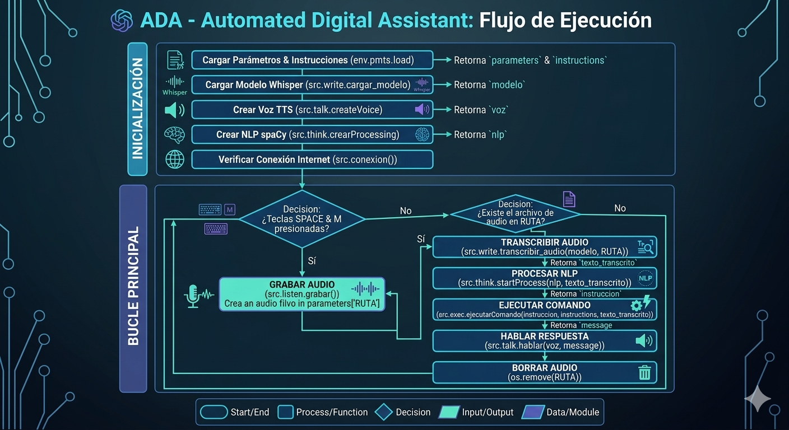

# ADA: Automated Digital Assistant

**Repositorio del proyecto:** [Ver el proyecto completo en GitHub](https://github.com/XLex0/ADA-Automated-Digital-Assistant-)

<p>
  
  
  
  
</p>

---

## Colaboradores

* **Alexander Motoche:** Concepción global del proyecto, arquitectura del backend, procesamiento de lenguaje natural (NLP) y desarrollo de la lógica de mapeo dinámico de comandos.

---

## Resumen

**ADA (Automated Digital Assistant)** es un asistente virtual de voz personal diseñado para automatizar flujos de trabajo en entornos Windows mediante comandos de voz nativos. El sistema captura audio local a través del micrófono, transcribe la instrucción con modelos de aprendizaje profundo y procesa el texto mediante técnicas avanzadas de procesamiento de lenguaje natural (NLP) para identificar y ejecutar acciones como abrir software de productividad, interactuar con motores de búsqueda en la web o verificar el estado de la red.

<div style="text-align: center;">
  
</div>

---

## Características Principales

* **Activación por Voz Inteligente:** Detección de intenciones basada en el lema de activación central (como el verbo auxiliar *poder*), permitiendo un lenguaje natural antes de la instrucción (ej. *"Hola Ada, ¿cómo estás? ¿Puedes abrir Word?"*).
* **Fuzzy Matching (Distancia de Levenshtein):** Tolerancia a fallos de pronunciación o variaciones menores en la transcripción, asegurando que los comandos coincidan con las palabras clave del sistema.
* **Mapeo Dinámico por JSON:** La configuración de aplicaciones, rutas de accesos directos (`.lnk`) y URLs web están completamente desacopladas del código duro mediante un archivo maestro extensible `instructions.json`.
* **Pipeline Descentralizado:** Arquitectura limpia que separa la grabación de audio, la transcripción automática (STT), el lematizado y la síntesis de voz final (TTS).

---

## Flujo del Pipeline de Ejecución

El ciclo de vida desde que se presiona la tecla de captura hasta la acción se divide en 5 etapas críticas:

1.  **Captura de Audio Local (`grabar.py`):** Controlado por la librería `PyAudio`, registra el flujo de voz mientras el usuario mantiene presionada la barra espaciadora (`space`), almacenándolo en un buffer optimizado WAV de 48kHz.
2.  **Transcripción Modular (`transcripcion.py`):** Utiliza el modelo **OpenAI Whisper (Small)** ejecutado localmente de forma asíncrona para convertir el archivo de audio grabado en texto crudo en español.
3.  **Procesamiento y Lematización (`procesarTexto.py`):** A través de la librería **spaCy** (`es_core_news_sm`), se remueven los signos gramaticales y las *stop words*, transformando las palabras conjugadas a sus lemas raíz en minúsculas.
4.  **Enrutamiento y Evaluación de Comandos (`controller.py`):** Analiza recursivamente el árbol JSON en busca de coincidencias semánticas usando evaluación de distancias tipográficas cortas.
5.  **Ejecución Nativa e Feedback de Voz (`hablar.py`):** Dispara un subproceso de Windows (`subprocess.run`) para abrir la aplicación o la consulta web requerida y paralelamente confirma al usuario mediante síntesis de voz con la librería `pyttsx3`.

---

## Estructura del Repositorio

El proyecto mantiene una distribución modular para facilitar el mantenimiento y escalabilidad de nuevas microfuncionalidades:

```text
📂 ADA-Automated-Digital-Assistant
 ┣ 📂 env                     # Entorno virtual local
 ┣ 📂 src                     # Código fuente de la aplicación
 ┃ ┣ 📂 instruction           # Scripts que contienen la lógica interna de cada acción
 ┃ ┃ ┣ 📜 abrir.py            # Orquestación de apertura de programas
 ┃ ┃ ┣ 📜 ingresar.py         # Control de navegación y búsquedas web
 ┃ ┃ ┣ 📜 responder.py        # Generación de respuestas inteligentes
 ┃ ┃ ┗ 📜 verificar.py        # Comprobación de estado y conectividad
 ┃ ┣ 📂 other                 # Utilidades generales del backend
 ┃ ┃ ┣ 📜 editarTexto.py
 ┃ ┃ ┗ 📜 microFuncionalidades.py  # Algoritmos complementarios (ej. Levenshtein)
 ┃ ┗ 📂 utils                 # Pipeline modular del asistente
 ┃   ┣ 📜 grabar.py           # Interfaz con PyAudio para grabación
 ┃   ┣ 📜 hablar.py           # Motor TTS (Text-to-Speech)
 ┃   ┣ 📜 procesarTexto.py    # Procesamiento NLP con spaCy
 ┃   ┣ 📜 transcripcion.py    # Motor STT (Speech-to-Text) con Whisper
 ┃   ┗ 📜 controller.py      # Núcleo de control de comandos y enrutador
 ┣ 📜 instructions.json       # Diccionario maestro de comandos y rutas relativas
 ┣ 📜 load.py                 # Cargador inicial del entorno
 ┣ 📜 params.json             # Parámetros del sistema
 ┗ 📜 .gitignore
```

---

## Configuración de Comandos (`instructions.json`)

El comportamiento del asistente se parametriza modificando el archivo estructurado. Puedes vincular cualquier ejecutable o acceso directo (`.lnk`) de Windows siguiendo el siguiente patrón de diseño del diccionario maestro:

```json
{
    "poder": {
        "abrir": {
            "word": ["Abriendo Word", "\"C:/ProgramData/Microsoft/Windows/Start Menu/Programs/Word.lnk\""],
            "brave": ["Abriendo Brave", "\"C:/ProgramData/Microsoft/Windows/Start Menu/Programs/Brave.lnk\""],
            "base": "from src.instruction.abrir import openF; openF(",
            "error": "Error encontrado en comando abrir"
        },
        "ingresar": {
            "youtube": {
                "buscar": ["buscando en Youtube", "\"https://www.youtube.com/results?search_query=\",0"],
                "default": ["ingresando a Youtube", "\"https://www.youtube.com/online\",1"],
                "error": "Error encontrado en comando ingresar, youtube"
            },
            "base": "from src.instruction.ingresar import select; select(",
            "error": "Error encontrado en comando ingresar"
        }
    }
}
```

---

## Instalación y Requisitos

### Prerrequisitos del Sistema
Para el correcto procesamiento y guardado de formatos de audio, el sistema requiere disponer del binario de **FFmpeg** configurado en las variables de entorno de Windows. Puedes instalarlo rápidamente mediante Chocolatey:

```bash
choco install ffmpeg
```

### Clonar e Instalar Dependencias
1. Clona el repositorio oficial:
   ```bash
   git clone https://github.com/XLex0/ADA-Automated-Digital-Assistant-.git
   cd ADA-Automated-Digital-Assistant
   ```
2. Instala los paquetes de Python requeridos:
   ```bash
   pip install -r requirements.txt
   ```
3. Descarga el modelo en español para procesamiento de texto con spaCy:
   ```bash
   python -m spacy download es_core_news_sm
   ```

---

## Instrucciones de Uso


1. Ejecuta el archivo principal o de pruebas para inicializar los modelos residentes en memoria:
   ```bash
   python test.py
   ```
2. Mantén presionada la **barra espaciadora (`space`)** en tu teclado para hablar.
3. Di tu comando usando la frase inicializada de activación para maximizar la efectividad del lematizador de spaCy. El sistema buscará la palabra de activación de la familia de **"puedes"**:
   > 🎙️ *“Hola, ¿cómo estás? **¿Puedes** abrir excel?”* > 🎙️ *“Ada, **puedes** buscar guitarras en youtube”*
4. Suelta la barra espaciadora. El sistema procesará el audio en segundo plano, la voz de ADA te dará una respuesta instantánea de confirmación y el subproceso del sistema operativo ejecutará la tarea en tu monitor de manera nativa.

---

**Repositorio del proyecto:** [Ver el proyecto completo en GitHub](https://github.com/XLex0/ADA-Automated-Digital-Assistant-)