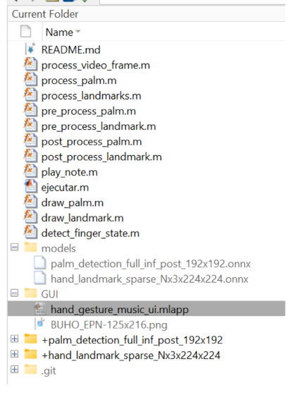
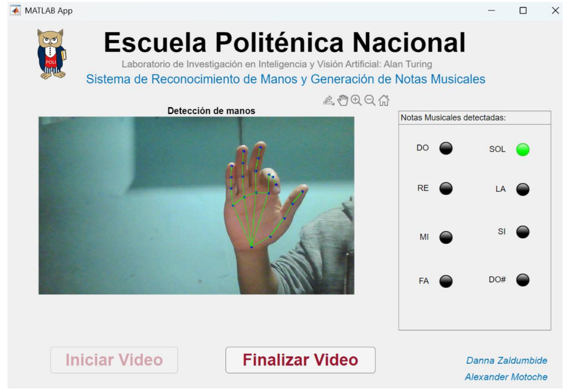
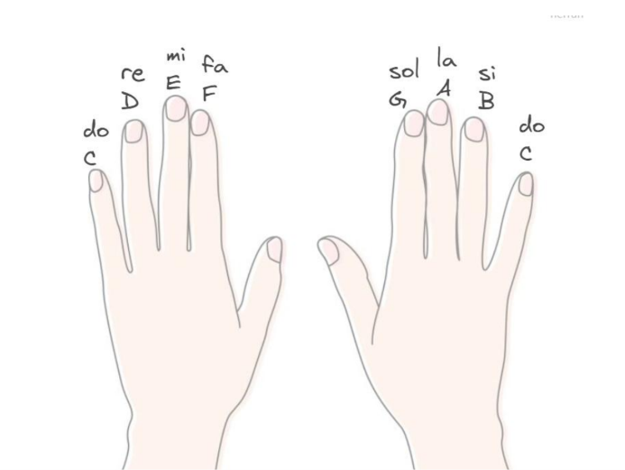

# Hands Recognition: Musical Gestual

**Repositorio del proyecto:**  
[Ver el proyecto completo en GitHub](https://github.com/DannaZal/HandsRecognition)

<p>
  
  
  
  
</p>

---

## Colaboradores

*   **Alexander Motoche:** Desarrollo de la lógica del sistema e integración/implementación de los modelos de visión artificial.
*   **Danna Zaldumbide:** Diseño y maquetación de la Interfaz Gráfica de Usuario (GUI).

---

## Resumen

Este proyecto permite interpretar y tocar notas musicales en tiempo real utilizando únicamente gestos de la mano capturados por una cámara web. El sistema procesa el flujo de video, detecta la presencia de las manos, identifica la posición exacta de los puntos clave de los dedos y reproduce un sonido específico en cuanto detecta que un dedo se cierra (se dobla). Todo esto se visualiza a través de una interfaz interactiva y amigable que superpone los puntos de control sobre la extremidad, ofreciendo una experiencia interactiva y fluida.

---

## Antecedentes

El reconocimiento y seguimiento de manos se ha convertido en un pilar fundamental para el desarrollo de interfaces de usuario sin contacto físico (*touchless interfaces*), impulsado por los avances en visión por computadora y aprendizaje profundo. 

Si bien existen múltiples librerías y ecosistemas optimizados en Python para realizar esta tarea, la oferta y los ejemplos prácticos desarrollados de forma nativa dentro de **MATLAB** son limitados. Este proyecto nace con el propósito de cubrir esa brecha, explorando el potencial de MATLAB para el despliegue de modelos de redes neuronales en formato **ONNX** y la creación de aplicaciones interactivas multimedia de alto rendimiento.

---

## Estructura del Proyecto

El entorno de desarrollo está organizado de manera modular para separar la lógica de ejecución, el almacenamiento de los modelos predictivos y los componentes visuales:

*   **`ejecutar.m`**: Script principal y punto de entrada del programa. Se encarga de inicializar el sistema y lanzar la interfaz gráfica.
*   **Scripts de procesamiento**: Funciones complementarias especializadas en las fases de preprocesamiento de imágenes (adaptación de resoluciones y formatos) y postprocesamiento (extracción e interpretación de coordenadas).
*   **`models/`**: Carpeta contenedora de los modelos de aprendizaje profundo en formato abierto ONNX:
    *   `palm_detection_full_inf_post_192x192.onnx`: Red encargada de localizar y encuadrar la presencia de las manos en la imagen.
    *   `hand_landmark_sparse_Nx3x224x224.onnx`: Red encargada de predecir y extraer los puntos de referencia (*landmarks*) tridimensionales de la mano.
*   **`GUI/`**: Contiene el archivo `.mlapp` desarrollado en MATLAB App Designer, el cual gestiona la capa visual y la interacción del usuario.

```text
📂 HandsRecognition
 ┣ 📜 ejecutar.m
 ┣ 📂 models
 ┃ ┣ 📜 palm_detection_full_inf_post_192x192.onnx
 ┃ ┗ 📜 hand_landmark_sparse_Nx3x224x224.onnx
 ┣ 📂 GUI
 ┃ ┗ 📜 interfaz.mlapp
 ┗ (Scripts de pre/post-procesamiento)
```

<div style="text-align: center;">
  
</div>


---

## Ejecución y Funcionamiento

### 1. Inicio del Sistema
Para iniciar el aplicativo, ejecute el script `ejecutar.m` desde la consola de MATLAB. Esto desplegará de forma automática la ventana principal de la interfaz gráfica. A continuación, presione el botón **"Iniciar Video"**. 

> 💡 **Nota:** La primera ejecución puede demorar unos segundos extra mientras el sistema realiza la carga y optimización de los modelos ONNX en memoria.

### 2. Detección y Mapeo en Tiempo Real
Una vez que la cámara se active, coloque su mano dentro del encuadre. El sistema dibujará dinámicamente un esqueleto virtual sobre la mano, uniendo los puntos clave con líneas interactivas para confirmar que el rastreo es correcto.

<div style="text-align: center;">
  
</div>


### 3. Mapeo de Notas Musicales
La aplicación cuenta con soporte para procesar hasta **dos manos simultáneamente**. Cada dedo (con excepción de los pulgares) actúa como un activador para una nota musical específica. El mapeo se distribuye de la siguiente manera desde la perspectiva del usuario:

| Mano Izquierda | Nota (Octava Baja) | Mano Derecha | Nota (Octava Alta) |
| :--- | :---: | :--- | :---: |
| Dedo Meñique | Do (C) | Dedo Índice | Do (C) |
| Dedo Anular | Re (D) | Dedo Medio | Re (D) |
| Dedo Medio | Mi (E) | Dedo Anular | Mi (E) |
| Dedo Índice | Fa (F) | Dedo Meñique | Fa (F) |

*Nota: La escala de la mano derecha corresponde a una octava más alta que la de la mano izquierda.*
<div style="text-align: center;">
  
</div>


### 4. Activación del Sonido
Para hacer sonar una nota, simplemente **doble el dedo correspondiente**. El algoritmo detectará el cambio de posición relativo entre las articulaciones, emitirá el sonido de forma inmediata y encenderá un indicador visual (foco) en el panel de control de la GUI para guiar al usuario sobre qué nota se está reproduciendo.

Para finalizar la sesión, haga clic en **"Finalizar Video"** y cierre la ventana de la aplicación.

---

## Recomendaciones para una Óptima Detección

Para garantizar la máxima precisión en el reconocimiento de gestos y evitar falsos positivos o latencia en el audio, siga estas pautas de uso:

*   **Orientación:** Mantenga la palma de la mano orientada de manera directa y frontal hacia la cámara.
*   **Alineación:** Procure que la mano se mantenga perpendicular al lente; evite giros de muñeca drásticos o inclinaciones pronunciadas hacia adelante o hacia atrás.
*   **Encuadre:** Asegúrese de que la mano completa permanezca dentro del campo de visión de la cámara para no interrumpir el flujo de coordenadas del modelo.

---

**Repositorio del proyecto:** [Ver el proyecto completo en GitHub](https://github.com/DannaZal/HandsRecognition)