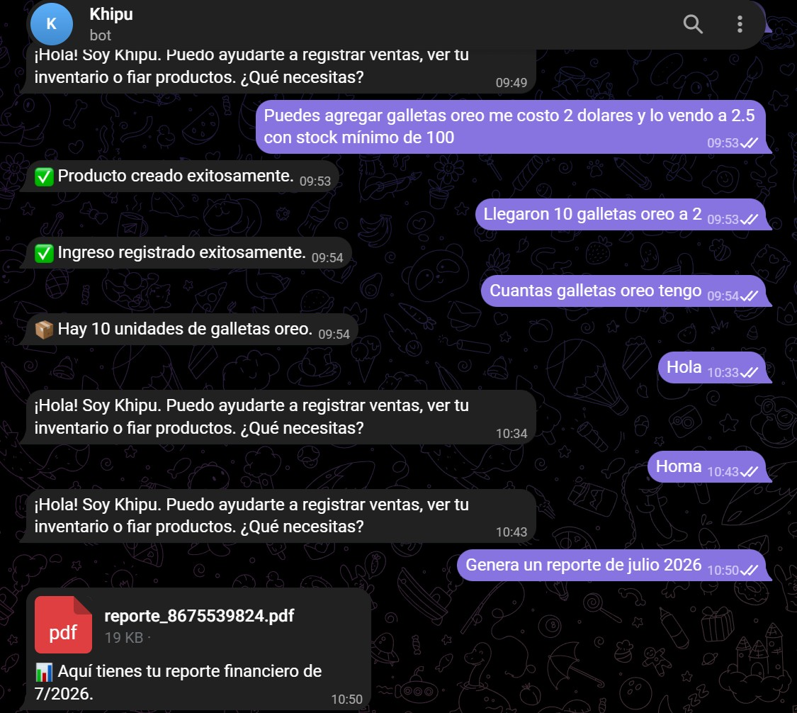

# Khipu Bot: Gestión de Inventario y Ventas vía Telegram

  
  
  
  
  
  

---
> **Propiedad Intelectual:** Al ser un desarrollo propio con potencial de comercialización, el repositorio principal es privado. Se comparten únicamente evidencias del funcionamiento, diseño de interfaz y arquitectura del software.
---

### Rol en el Proyecto
* **Alexander Motoche:** Arquitectura del sistema, lógica centralizada de negocio, integración de modelos de IA (LLM), diseño del modelo de datos en PostgreSQL, infraestructura de servicios de mensajería (Telegram API) y motor de generación de reportes.

---

### Resumen
**Khipu Bot** es un sistema inteligente de gestión diseñado para facilitar el control de inventarios, ventas y cuentas por cobrar a través de una interfaz conversacional en Telegram. El proyecto utiliza un modelo de lenguaje (LLM) para interpretar el lenguaje natural del usuario, permitiendo registrar movimientos de mercadería o consultar deudas sin necesidad de comandos rígidos. Los datos se almacenan de forma segura bajo un esquema aislado por usuario dentro de una base de datos PostgreSQL, garantizando privacidad, integridad y escalabilidad del servicio.

  

---

### Antecedentes y Propuesta de Valor
La gestión administrativa en pequeños negocios suele enfrentar barreras tecnológicas debido a la complejidad y costo de los sistemas ERP tradicionales. Khipu Bot nace para cubrir la brecha entre la potencia de la Inteligencia Artificial y las necesidades cotidianas de los comerciantes, transformando una aplicación de mensajería común en una herramienta de gestión financiera de alto rendimiento. A diferencia de un chatbot tradicional, Khipu implementa una **gestión de estado y memoria de operación** que permite mantener el contexto durante diálogos extendidos.

---

### Arquitectura y Tecnologías Aplicadas
El sistema se construyó bajo un diseño modular y desacoplado, garantizando que el motor de IA, la API web y la capa de persistencia operen de forma independiente:

* **Backend & Webhooks:** API REST desarrollada en **Python (FastAPI)** para la recepción y procesamiento asíncrono de eventos de Telegram.
* **Orquestación de IA:** Integración con modelos **LLM (Google Gemini)** para clasificación de intenciones (*Intent Classification*), extracción de entidades (*NER*) e ingeniería de prompts avanzada.
* **Base de Datos & Seguridad:** Arquitectura relacional sobre **PostgreSQL**, implementando aislamiento multi-usuario y consultas optimizadas.
* **Módulos de Negocio Integrados:**
  * **Gestión de Catálogo** 
  * **Motor Transaccional** 
  * **Control de Deudas** 
  * **Analítica & Reporte** 

  

---

### Flujo de Operación
1. **Recepción:** El servicio asíncrono captura los mensajes del usuario enviados a la interfaz de Telegram.
2. **Clasificación y Extracción:** El agente de IA procesa el lenguaje natural, determina la intención operativa y extrae las variables clave de la transacción.
3. **Control de Calidad y Desambiguación:** Incluye un módulo de concordancia difusa (*fuzzy matching*) para comparar la entrada del usuario con los registros reales de la base de datos, corrigiendo automáticamente errores ortográficos, variaciones o plurales.
4. **Persistencia y Respuesta:** Ejecuta la transacción en la base de datos y responde al usuario confirmando la operación o solicitando los datos faltantes si el mensaje era incompleto.

| Categoría | Acciones Disponibles | Ejemplo de Entrada |
| :--- | :--- | :--- |
| **Catálogo** | Crear, actualizar o desactivar productos y consultar stock. | *"¿Cuánto tengo de arroz?"* |
| **Transacciones** | Registrar ventas, ingresos de stock y mermas. | *"Vendí 2 latas de atún"* |
| **Deudas** | Registrar nuevos fiados, abonos y consultar saldos. | *"Juan me debe 5 dólares"* |
| **Reportes** | Analítica de ventas, valoración y exportación a PDF. | *"Dame el reporte del mes"* |

---

### Recomendaciones para una Óptima Gestión
* **Consistencia en Nombres:** Mantener nombres claros en los productos facilita la búsqueda inteligente en el catálogo.
* **Interacción Conversacional:** Si faltan datos en una transacción (ej. precio o cantidad), el bot preguntará automáticamente al usuario para completar la operación.
* **Alertas Inteligentes:** Notificaciones automáticas cuando un producto cruza el umbral de stock mínimo configurado.

---

### 📌 Estado del Proyecto
El código fuente y la configuración de infraestructura se mantienen en un **repositorio privado**. Para consultas técnicas, demostraciones en vivo o alianzas, contactar directamente al desarrollador.