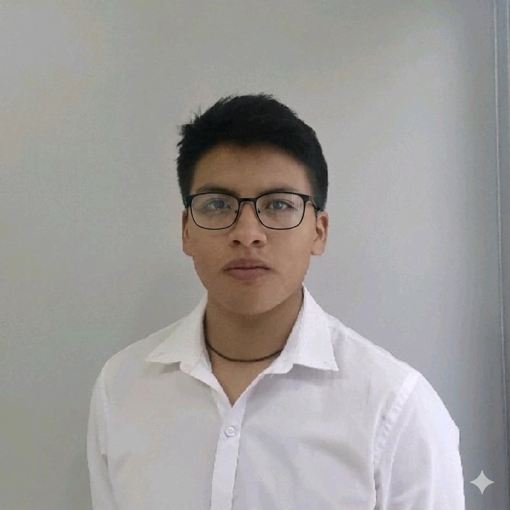

# 🚀 PORTAFOLIO DE PROYECTOS

<table width="100%" style="border-collapse: collapse; border: none; margin-bottom: 20px;">
  <tr style="border: none; background-color: transparent;">
    <td width="28%" style="border: none; text-align: center; vertical-align: middle;">
      
    </td>
    <td width="72%" style="border: none; padding-left: 25px; vertical-align: middle;">
      <h1 style="margin: 0; color: #1a365d; font-size: 2.1em; font-family: -apple-system, BlinkMacSystemFont, 'Segoe UI', Roboto, Helvetica, Arial, sans-serif;">Alexander Xavier Motoche Viracocha</h1>
      
<strong>Estudiante de Ingeniería de Software</strong>

      

        

          Estudiante en la Escuela Politécnica Nacional con enfoque en Inteligencia Artificial, 
          Analítica de Datos y Desarrollo Backend. Experiencia práctica en el diseño de soluciones inteligentes, 
          automatización de procesos y construcción de software útil orientado a la toma de decisiones en entornos reales.
        

      

    </td>
  </tr>
</table>

---

## <svg style="width:22px; height:22px; vertical-align:text-bottom; margin-right:6px; fill:#1a365d" viewBox="0 0 24 24"><path d="M20,6C20,4.89 19.11,4 18,4H16V2H8V4H6C4.89,4 4,4.89 4,6V19C4,20.11 4.89,21 6,21H18C19.11,21 20,20.11 20,19V6M8,4H16V6H8V4M6,19V6H18V19H6M7,11H9V13H7V11M11,11H13V13H11V11M15,11H17V13H15V11M7,15H9V17H7V15M11,15H13V17H11V15M15,15H17V17H15V15Z"/></svg> EXPERIENCIA PROFESIONAL

  <table width="100%" style="border-collapse: collapse; border: none;">
    <tr style="border: none; background-color: transparent;">
      <td style="border: none;"><strong style="font-size: 1.15em; color: #2b6cb0;">Laboratorio de Investigación en Inteligencia y Visión Artificial</strong></td>
      <td align="right" style="border: none; color: #718096; font-size: 0.9em;"><em>08/2024 - 01/2026 | Quito, Ecuador</em></td>
    </tr>
    <tr style="border: none; background-color: transparent;">
      <td colspan="2" style="border: none; padding-top: 4px; color: #4a5568; font-size: 0.95em;"><strong>Ayudante de Investigación</strong></td>
    </tr>
  </table>
  <ul style="margin-top: 10px; padding-left: 20px; color: #2d3748; line-height: 1.6; font-size: 0.95em;">
    <li>Procesamiento, recolección y curación de grandes volúmenes de datos para el ajuste y optimización de modelos de Inteligencia Artificial.</li>
    <li>Ajuste, prueba e implementación de modelos predictivos y de visión artificial en aplicaciones funcionales prácticas dentro de entornos reales.</li>
    <li>Revisión sistemática de literatura científica para dar soporte metodológico a las experimentaciones del área.</li>
  </ul>

  <table width="100%" style="border-collapse: collapse; border: none;">
    <tr style="border: none; background-color: transparent;">
      <td style="border: none;"><strong style="font-size: 1.15em; color: #2b6cb0;">Banco de Alimentos Quito</strong></td>
      <td align="right" style="border: none; color: #718096; font-size: 0.9em;"><em>05/2024 - 02/2025 | Quito, Ecuador</em></td>
    </tr>
    <tr style="border: none; background-color: transparent;">
      <td colspan="2" style="border: none; padding-top: 4px; color: #4a5568; font-size: 0.95em;"><strong>Backend Developer</strong></td>
    </tr>
  </table>
  <ul style="margin-top: 10px; padding-left: 20px; color: #2d3748; line-height: 1.6; font-size: 0.95em;">
    <li>Diseño y desarrollo de APIs RESTful utilizando arquitectura de microservicios para optimizar y asegurar los sistemas internos de la organización.</li>
    <li>Modelamiento de datos y estructuración exhaustiva de documentación técnica, manuales de usuario y reportes internos de procesos.</li>
    <li>Construcción e integración de interfaces gráficas de usuario operativas y conectadas de forma eficiente a flujos lógicos estables.</li>
  </ul>

  <table width="100%" style="border-collapse: collapse; border: none;">
    <tr style="border: none; background-color: transparent;">
      <td style="border: none;"><strong style="font-size: 1.15em; color: #2b6cb0;">Instituto Geográfico Militar</strong></td>
      <td align="right" style="border: none; color: #718096; font-size: 0.9em;"><em>01/2024 - 09/2024 | Quito, Ecuador</em></td>
    </tr>
    <tr style="border: none; background-color: transparent;">
      <td colspan="2" style="border: none; padding-top: 4px; color: #4a5568; font-size: 0.95em;"><strong>Game Developer</strong></td>
    </tr>
  </table>
  <ul style="margin-top: 10px; padding-left: 20px; color: #2d3748; line-height: 1.6; font-size: 0.95em;">
    <li>Desarrollo lógico de mecánicas de juego interactivas y estructuración fluida de flujos complejos de ejecución del software.</li>
    <li>Modelado, diseño compositivo de escenas y optimización de menús interactivos y niveles escalables.</li>
  </ul>

---

## <svg style="width:22px; height:22px; vertical-align:text-bottom; margin-right:6px; fill:#1a365d" viewBox="0 0 24 24"><path d="M12,3L1,9L12,15L21,10.09V17H23V9L12,3M20,11.53V14.5C20,15.74 18.21,17 16,17C13.79,17 12,15.74 12,14.5V11.53L12,15L12,15.42L11.91,15.5L12,15.54V15.57L12,19C11,19.34 9.42,19.5 8,19.5C5.17,19.5 4,18.5 4,17.5V14.33L12,11.53M8,14.5C8,15.33 9.79,16 12,16C14.21,16 16,15.33 16,14.5C16,13.67 14.21,13 12,13C10,13 8,13.67 8,14.5Z"/></svg> EDUCACIÓN

  <table style="width: 100%; min-width: 100%; border-collapse: collapse; border: none; background-color: transparent;">
    <tr style="border: none; background-color: transparent;">
      <td style="border: none; padding: 0;">
        <strong style="font-size: 1.1em; color: #2d3748;">Ingeniería de Software</strong> 
        Escuela Politécnica Nacional
      </td>
      <td align="right" style="border: none; color: #718096; vertical-align: middle; font-size: 0.9em; padding: 0;">
        <em>11/2021 - Actualidad</em> Quito, Ecuador
      </td>
    </tr>
  </table>

---
## <svg style="width:22px; height:22px; vertical-align:text-bottom; margin-right:6px; fill:#1a365d" viewBox="0 0 24 24"><path d="M13,8.5H11V6.5H13V8.5M13,13H11V11H13V13M13,17.5H11V15.5H13V17.5M22,10V6C22,4.89 21.1,4 20,4H4C2.9,4 2,4.89 2,6V10C3.11,10 4,10.9 4,12C4,13.1 3.11,14 2,14V18C2,19.1 2.9,20 4,20H20C21.1,20 22,19.1 22,18V14C20.9,14 20,13.1 20,12C20,10.9 20.9,10 22,10M20,8.54V9.64C18.84,10.33 18,11.58 18,13C18,14.42 18.84,15.67 20,16.36V18H4V16.36C5.16,15.67 6,14.42 6,13C6,11.58 5.16,10.33 4,9.64V6H20V8.54Z"/></svg> CERTIFICACIONES

  

    <strong style="font-size: 1.05em; color: #2d3748;">E-Commerce y Marketing Digital</strong> — talentAcademy S.A.S. 
    ID de la credencial: MDT-OC-1222216
  

  

    mar. 2026
  

  

    <strong style="font-size: 1.05em; color: #2d3748;">Google Business Intelligence Certificate</strong> — Google
  

  

    oct. 2025
  

  

    <strong style="font-size: 1.05em; color: #2d3748;">Endpoint Security</strong> — Cisco
  

  

    may. 2025
  

  

    <strong style="font-size: 1.05em; color: #2d3748;">Networking Devices & Initial Config</strong> — Cisco
  

  

    mar. 2025
  

---
## <svg style="width:22px; height:22px; vertical-align:text-bottom; margin-right:6px; fill:#1a365d" viewBox="0 0 24 24"><path d="M20,4H4C2.89,4 2,4.89 2,6V18A2,2 0 0,0 4,20H20A2,2 0 0,0 22,18V6C22,4.89 21.1,4 20,4M20,6L12,11L4,6H20M20,18H4V8L12,13L20,8V18Z"/></svg> CONTACTO Y REDES

Si deseas conversar sobre alguna oportunidad laboral o revisar mis proyectos de desarrollo, no dudes en contactarme:

<ul style="list-style: none; padding-left: 5px; line-height: 2;">
  <li>
    ✉️ 
    <a href="mailto:alexander.redes17@gmail.com" style="color: #2b6cb0; text-decoration: none; font-weight: 500;">alexander.redes17@gmail.com</a>
  </li>
  <li>
    💼 
    <a href="https://www.linkedin.com/in/alexander-motoche-208510327/" target="_blank" style="color: #2b6cb0; text-decoration: none; font-weight: 500;">linkedin.com/in/alexander-motoche-208510327</a>
  </li>
</ul>